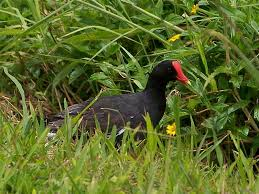

```{r setup, include=FALSE}
knitr::opts_chunk$set(echo = TRUE)
```

# Preparations

Load the necessary libraries

```{r libraries, results='markdown', eval=TRUE}
library(tidyverse)
```

# Scenario

This is an entirely fabricated example (how embarrising).
So here is a picture of some Red Grouse Chicks to compensate..

{width="251" height="290"}

Format of reed.csv data file

Year Stilt.Oahu Stilt.Maui Coot.Oahu Coot.Maui Moorhen.Kauai Rainfall
---- ---------- ---------- --------- --------- ------------- --------
1956 163        169        528       177       2             15.16
1957 272        190        338       273       NA            15.48
1958 549        159        449       256       2             16.26
1959 533        211        822       170       10            21.25
1960 NA         232        NA        188       4             10.94
1961 134        155        717       149       10           19.93

-------------- ---------------------------------------------------------------------------------------------------------------------------------------------------------------------------------------------------------------------------------------------------------------------------------------------------------------------------------------------------
**Year**          - a continuous predictor
**Stilt.Oahu**    - the abundance of the Oahu stilt
**Stilt.Maui**    - the abundance of the Maui stilt 
**Coot.Oahu**     - the abundance of the Oahu coot 
**Coot.Maui**     - the abundance of the Maui coot
**Moorhen.Kauai** - the abundance of the Kauai moorhen
**Rainfal**       - the number of centimeters (or inches) of rain
-------------- ---------------------------------------------------------------------------------------------------------------------------------------------------------------------------------------------------------------------------------------------------------------------------------------------------------------------------------------------------

# Read in the data

```{r readData, results='markdown', eval=TRUE}
reed = read_csv('data/reed.csv', trim_ws=TRUE)
glimpse(reed)
```


# Exploratory data analysis

Model formula:
$$
y_i \sim{} \mathcal{N}(\mu_i, \sigma^2)\\
\mu_i =\beta_0 + f(Year_i) + f(Rainfall_i)
$$

where $\beta_0$ is the y-intercept. $f(Year)$ and $f(Rainfall)$ indicate the additive smoothing functions of Year and Rainfall respectively. 

# Fit the model

# Model validation

# Model investigation / hypothesis testing

# Predictions

# Summary figures

# References