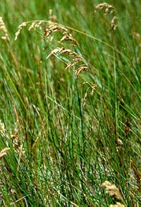

```{r setup, include=FALSE}
knitr::opts_chunk$set(echo = TRUE)
```

# Preparations

Load the necessary libraries

```{r libraries, results='markdown', eval=TRUE}
library(tidyverse)
```

# Scenario

Coming soon...

{width="251" height="290"}

Format of paruelo.csv data file


# Read in the data

```{r readData, results='markdown', eval=TRUE}
paruelo = read_csv('data/paruelo.csv', trim_ws=TRUE)
glimpse(paruelo)
```


# Exploratory data analysis

Model formula:
$$
y_i \sim{} \mathcal{N}(\mu_i, \sigma^2)\\
\mu_i =\beta_0 + f(Date_i) + f(Month_i)
$$

where $\beta_0$ is the y-intercept. $f(Date)$ and $f(Month)$ indicate the additive smoothing functions of the long-term temporal trends and the annual seasonal trends respectively. 

# Fit the model

# Model validation

# Model investigation / hypothesis testing

# Predictions

# Summary figures
