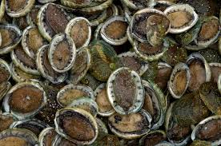

```{r setup, include=FALSE}
knitr::opts_chunk$set(echo = TRUE)
```

# Preparations

Load the necessary libraries

```{r libraries, results='markdown', eval=TRUE}
library(tidyverse)
```

# Scenario

Abalone are an important aquaculture shell fish that are farmed
for both their meat and their shells.  Abalone can live up to 50 
years, although their longevity is known to be influenced by a 
range of environmental factors.  Traditionally, abalone are aged
by counting thier growth rings, however, this method is very
laborious and expensive.  Hence a study was conducted in which abalone
growth ring counts were matched up with a range of other more easily
measured physical characteristics (such as shell dimesions and weights)
in order to see if any of these other parameters could be used as
proxies for the number of growth rings (or age).

{width="251" height="290"}

Format of abalone.csv data file


# Read in the data

```{r readData, results='markdown', eval=TRUE}
abalone = read_csv('data/abalone.csv', trim_ws=TRUE)
glimpse(abalone)
```


# Exploratory data analysis

# Fit the model

# Model validation

# Model investigation / hypothesis testing

# Predictions

# Summary figures
